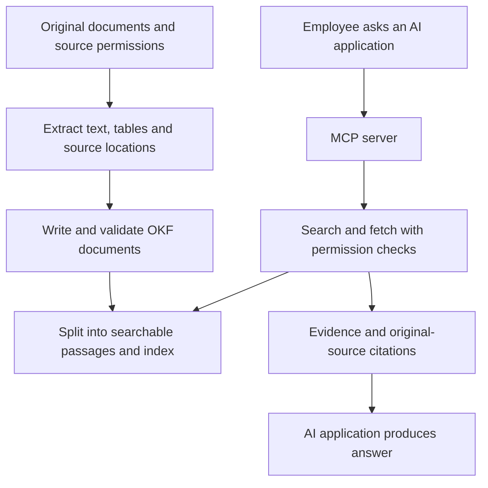

# Enterprise knowledge RAG with OKF and MCP

Planning baseline: 24 September 2026. Phases 2–4 are implemented as a pilot against a synthetic corpus (see [Implementation status](#implementation-status)); phases 1 and 5 remain open.

Reverified against OKF v0.2 and [Red Hat template commit `286b9e7`](https://github.com/redhat-data-and-ai/template-mcp-server/tree/286b9e7b732af9d58f9dfd9be68c071e55919ea4). A dependency-resolution dry run passed on macOS ARM64 / Python 3.12.2 for the template's runtime/dev requirements plus Docling and PyYAML (resolved Docling 2.95.0, FastMCP 2.14.2 and Pydantic 2.11.7). A local SQLite 3.45.3 FTS5 create/insert/search check also passed. These checks did not install or run the application; extraction, Linux container compatibility, client interoperability and deployment remain unverified.

## Goal

Let employees ask questions about enterprise information and receive answers grounded in documents they are allowed to access, with citations to the original sources.

Three components have different jobs:

- **OKF:** portable knowledge documents, represented as Markdown with YAML metadata.
- **RAG:** find relevant evidence and supply it to an AI model when answering a question.
- **MCP:** expose retrieval tools so compatible AI applications can use the knowledge service.

The upstream repository currently documents OKF v0.2. Its reference agent demonstrates BigQuery metadata enrichment and web documentation enrichment; it is not a ready-made converter for every enterprise format. See the [repository](https://github.com/GoogleCloudPlatform/open-knowledge-format) and [specification](https://github.com/GoogleCloudPlatform/open-knowledge-format/blob/main/SPEC.md).

## Proposed flow

Keep originals intact. OKF is a derived knowledge layer, and the search index is rebuildable. Indexing should preserve detailed extracted content; generated summaries alone can omit evidence needed to answer questions.

## Initial scope and assumptions

Start with one local folder, one department, 100–300 representative documents, and one local pilot operator. These are proposed limits, not known facts about the user's data. Choose two or three formats based on the actual collection. Use synthetic or approved sample documents until the permitted processing environment is known.

Start with one Python application, built strictly on the [Red Hat template MCP server](https://github.com/redhat-data-and-ai/template-mcp-server), plus one ingestion command. The first deliverable is an end-to-end retrieval demo through an existing MCP client. No custom chat UI is needed for that milestone.

The template's configured server entry point supports HTTP/SSE, not stdio. The pilot runs over streamable HTTP at `http://localhost:5001/mcp`, with `MCP_HOST=localhost`, `ENABLE_AUTH=False` and `USE_EXTERNAL_BROWSER_AUTH=False`. This is an unauthenticated, trusted-machine demo: any process able to reach it can read its corpus. Use only documents approved for that environment; enable authentication before shared access or connecting sensitive enterprise content. Verified: FastMCP 2.14.2 leaves the MCP SDK's DNS-rebinding protection off, so `src/api.py` adds a Host/Origin check that accepts only loopback values whenever authentication is disabled or the bind address is loopback (`/health` is exempt for probes). A cloud-hosted MCP client cannot reach this localhost endpoint directly; choose a local client for the pilot. [MCP transport requirements](https://modelcontextprotocol.io/specification/2025-11-25/basic/transports).

## MCP server template

The project is created from the template and follows its conventions rather than introducing new ones.

- **Create and rename:** start from the reviewed template revision, rename `template_mcp_server` to `okf_mcp_server`, and follow its rename checklist (`pyproject.toml`, `Makefile`, `Containerfile`, `compose.yaml`, `deployment/openshift/`, workflows, README). Check executable/configuration references with the template's leftover-reference `grep` command from its README (or install ripgrep first if using `rg`); retain upstream attribution links. Paths below are relative to the renamed Python package unless stated otherwise.
- **Remove examples:** delete `multiply_tool.py`, `code_review_tool.py`, `redhat_logo_tool.py`, the `assets/` logo and their tests.
- **One file per tool:** `src/tools/browse_knowledge_tool.py`, `search_knowledge_tool.py` and `get_knowledge_tool.py`. Each uses the template's docstring metadata block (`TOOL_NAME`, `USECASE`, `INPUT_DESCRIPTION`, `OUTPUT_DESCRIPTION` and so on), the structlog logger from `utils/pylogger.py`, and its success-payload convention. Register them in `_register_mcp_tools()` in `src/mcp.py`. Ensure execution failures become MCP results with `isError: true` by raising `fastmcp.exceptions.ToolError`; a JSON payload containing `status: error` alone does not set that protocol flag. This deliberately differs from the template's example tools, which return error payloads. An empty successful search is not an execution failure. [MCP error handling](https://modelcontextprotocol.io/specification/2025-11-25/server/tools#error-handling).
- **Retrieval code:** a small `src/knowledge/` package (bundle reader, frontmatter parsing, search index) shared by the three tools.
- **Configuration:** add `OKF_DATA_DIR` to the Pydantic `Settings` in `src/settings.py` and to `.env.example`. It holds immutable snapshots and a `current` symlink; the bundle, extraction metadata and index are always resolved from the same snapshot, which separate `OKF_BUNDLE_PATH`/`OKF_INDEX_PATH` settings could not guarantee. `make local` copies `.env.example` to `.env` when `.env` is missing; when starting the server entry point directly, create `.env` first, because the code default for `ENABLE_AUTH` is `True` and the example file sets `False`.
- **Ingestion command:** a second `[project.scripts]` entry (`okf-ingest`) in the same package. Put Docling in an `ingest` extra under `[project.optional-dependencies]`; install it explicitly with `uv pip install -e '.[dev,ingest]'` in the development environment. Keep ingestion imports out of server startup so the server image works without that extra. Verify dependency resolution against the template's pinned versions. Declare a safe YAML parser as a direct runtime dependency for frontmatter parsing.
- **Quality gates:** keep the template's pytest, ruff, mypy, bandit and pre-commit setup and GitHub workflows. New tools get tests in `tests/test_tools.py`, including path-traversal and output-size cases. The template's CI installs only `.[dev]` and enforces `--cov-fail-under=80` across the package. Keep Docling calls in one thin adapter module and test the rest of ingestion with fixture Markdown/JSON; then either install `.[dev,ingest]` in CI and test the adapter, or exclude only that adapter from coverage and test it in a separate ingestion job.
- **Run and connect:** `make install` (it opens an interactive shell; exit that shell when finished), install the ingestion extra, then `make local`. Check `/health`, then connect a local MCP client to `http://localhost:5001/mcp`. Verify the MCP initialization handshake and an actual tool call; `/health` alone does not prove retrieval works. If using the template's Compose setup, change its published MCP port to `127.0.0.1:5001:5001` before running an unauthenticated demo. Compose also starts PostgreSQL (a `depends_on` of the server), published as `5432:5432` on all interfaces with the password `postgres`. PostgreSQL is only needed for OAuth: for the pilot, remove the dependency and service, or bind it to `127.0.0.1:5432:5432` and replace the default credentials.
- **Deployment:** the template's UBI `Containerfile` copies the Python package; its OpenShift manifests currently provide no knowledge volume. Add bundle/index mounts, path configuration and a PersistentVolumeClaim if using OpenShift. Serve read-only snapshots; the ingestion job writes a separate snapshot, validates it, then switches the matching bundle and index together. Each request uses one snapshot throughout. Keep the previous snapshot available if ingestion fails, but apply current permission revocations and deletion restrictions even after rollback. Final hosting remains subject to the enterprise environment.

Template gaps to close in phase 5:

- The OAuth middleware in `src/api.py` validates a bearer token but discards its claims before calling tools. Propagate a request-scoped identity keyed by the trusted issuer and stable `sub`; resolve enterprise group membership for permission filtering. Fail closed when identity or permissions are unavailable.
- Keep `USE_EXTERNAL_BROWSER_AUTH=False` for shared deployments. The alternate browser-auth middleware injects a process-wide cached token and bypasses the normal token-verification middleware; it does not establish a separate validated identity for each caller. Test two users, token expiry/revocation, expected token audience and required scopes before rollout. Correct the template's hard-coded OAuth discovery scopes for this application.
- The template's own `/auth/token` endpoint returns hard-coded placeholder access tokens (`oauth_access_token_placeholder`, `client_credentials_access_token_placeholder`) in `src/oauth/controller.py`. They should fail SSO introspection, so this is not an evident bypass, but the endpoint must issue or proxy real tokens before OAuth mode is usable.
- OAuth mode requires an OIDC provider and PostgreSQL for token storage. The same PostgreSQL instance can later host pgvector.

## OKF mapping for the pilot

- **One concept per source document**, or per major section for long documents. Keep a manifest mapping stable source IDs to bundle paths and source revisions. Disambiguate same-stem files and section names, and never map a source document to reserved `index.md` or `log.md`. Handle renames without leaving stale duplicate content.
- **`type`** comes from a small producer vocabulary agreed during inventory (for example `Policy`, `SOP`, `Contract`, `Specification`, `Reference`). Consumers still accept unknown types and preserve extension fields.
- **Frontmatter is filled deterministically** from file metadata and the ingestion run: `title`, `sources`, `generated: { by: <ingest tool>/<version>, at: <ISO-8601 timestamp with UTC offset> }`, `status: draft`. Use local extraction/OCR without generative summarization for the pilot; extraction may still need model downloads and compute. Configure processing to stay local and provision model files offline when required. The answering AI's data-processing approval is a separate requirement. Generated `description` and `tags` can be added later as a reviewable step.
- **Lifecycle and trust:** mark superseded documents `status: deprecated`, set `stale_after` from the owner's review cycle, and record owner sign-off in `verified` with a `human:<id>` actor.
- **Citation convention:** keep the original source URI in `sources[].resource`, with stable source IDs. Each passage also stores the source revision and page, sheet/cell range or section as application metadata. Return an accessible source link plus a readable location. Local file links are pilot-only; page and spreadsheet fragments are viewer-dependent and must be tested with the chosen client. Do not promise a universal Excel deep-link syntax or invent page numbers lost during extraction.
- **Durable extraction metadata:** persist the extracted structure and its source-location mapping alongside each OKF snapshot, outside the search database. Docling JSON preserves its document representation and available provenance; retain the mapping from extracted items to OKF sections too. Rebuilding the index must preserve citations without guessing locations from Markdown. These application files accompany the bundle and are not required OKF fields. [Docling document model](https://docling-project.github.io/docling/concepts/docling_document/).
- **Index files:** generate `index.md` in every directory for progressive disclosure, and declare `okf_version: "0.2"` in the root `index.md`.

## Build sequence

| Phase | Work | Completion evidence |
| --- | --- | --- |
| 1. Inventory | Identify source systems, formats, languages, scanned pages, volume, owners, permissions, refresh needs and cloud constraints. Collect about 30 real questions with expected source documents. | An agreed pilot corpus and question set. |
| 2. Conversion | Extract text and tables; use OCR for scans. Preserve headings and page/sheet/section locations. Write OKF documents using the mapping above and generate `index.md` files. | A reviewed sample from every pilot format; failures are visible and retryable; conformance checks include concept frontmatter/type and reserved-file structure (spec §11). Check our emitted metadata shapes and timestamps separately. |
| 3. Retrieval | Split along document structure and preserve table headers. Start with SQLite FTS5 keyword search over passages and selected metadata, and measure against the question set. Python exposes SQLite, but FTS5 depends on its build: verify a temporary FTS5 table can be created in both development and the server image. Parameterize SQL and handle ordinary user punctuation without treating it as raw FTS query syntax. Add embeddings if measured retrieval quality falls short. Store stable document IDs, versions, source locations and access metadata with passages. | Record Hit@5: the fraction of answerable questions with at least one correct supporting passage in the first five results. Test exact codes, paraphrases and corpus languages. For multi-source questions, separately check that all evidence needed for the answer is retrieved. Verify FTS5 availability and input handling. |
| 4. MCP | Add browse, search and document-fetch tools following the template conventions. Connect a compatible AI application and have it answer with citations or state that evidence is insufficient. | Agreed pilot questions work end to end, including insufficient-evidence cases. Verify citations after index rebuild, long-section continuation and MCP error flags; `make lint`, `make test` and the retained pre-commit checks pass. |
| 5. Enterprise rollout | Enable OAuth with the enterprise provider, close the authentication/identity gaps, and add source-permission synchronization, incremental ingestion, deletion handling, audit logs, backups and scheduled refresh. Adapt the template's OpenShift manifests if OpenShift is the selected host. Add connectors one at a time. | Two-user isolation across browse/search/fetch, permission-revocation, deletion, update and recovery checks pass before broader access. |

Create and rename the template project before phase 2 so ingestion and retrieval are built inside the intended package. Phase 4 adds the MCP tool integration rather than migrating a separate prototype.

Measure retrieval quality, answer support, latency and processing cost in the pilot. Set numerical release targets with the business owner after establishing the baseline. Include questions with no answer in the corpus and deliberately conflicting or outdated documents; check that deprecated and stale concepts are flagged in results rather than presented as current.

## Suggested components

- **Red Hat template MCP server:** the project base (Python 3.12+, FastMCP on FastAPI, Pydantic settings, structlog, OAuth, UBI container, OpenShift manifests). Ingestion lives in the same package as a separate command.
- **Docling:** evaluate for document extraction; its [supported formats](https://docling-project.github.io/docling/usage/supported_formats/) include PDF, DOCX, XLSX and PPTX, with Markdown export. Test fidelity on actual files before committing to it.
- **OKF files:** store in a protected local directory for the pilot; use approved storage for rollout. Pin the implemented specification version.
- **SQLite FTS5:** pilot search index; a single rebuildable file with no server to operate. Confirm the deployed SQLite build enables it. [FTS5 build documentation](https://www.sqlite.org/fts5.html#compiling_and_using_fts5).
- **PostgreSQL with pgvector:** a rollout candidate, or earlier if the pilot shows embeddings are needed, for storing passage metadata and embeddings together, using PostgreSQL text search alongside vector retrieval. [pgvector documentation](https://github.com/pgvector/pgvector).
- **Embedding and answer models:** choose after confirming language, privacy, deployment and budget requirements. OKF does not require a particular model provider.

An embedding is a numerical representation of text used to find passages with similar meaning. Keyword search complements it for exact names, identifiers and codes.

## Minimal MCP interface

These are proposed application tool names, not prescribed MCP tool names.

| Tool | Inputs | Output |
| --- | --- | --- |
| `browse_knowledge` | Bundle-relative directory path (default: root) and bounded page size/cursor | Authorized titles, descriptions and subdirectories, derived from `index.md` or synthesized when absent. Filter entries and directory visibility before returning them; never return a raw shared index. |
| `search_knowledge` | Query, optional `type`/`tags` filters and bounded result limit | Permitted passage excerpts, concept IDs, titles, source locations, `status`, trust tier (unverified, machine-confirmed or human-reviewed, per spec §5.3) and a stale flag from `stale_after`. |
| `get_knowledge` | Concept ID, optional section, bounded page size and optional continuation cursor | Permitted content with provenance, source references, lifecycle/trust information and a next cursor when more content remains. |

`browse_knowledge` uses OKF's progressive disclosure: the AI application can navigate the hierarchy when keyword search misses.

Once OAuth is enabled, all tools use the authenticated caller's identity, obtained from the validated token rather than from tool arguments. They must not accept a caller-supplied identity as proof of permission. Fetch by an opaque ID or validated bundle-relative path, never an unrestricted filesystem path. Resolve paths and symlinks within the approved bundle root. Bound output size for all tools and provide pagination or section continuation instead of silently dropping content. Use a safe YAML loader; source links are citations, not permission to fetch arbitrary URLs or execute referenced code.

Continuation cursors identify the snapshot and position, not access rights. Recheck authorization on every page. If the referenced snapshot is unavailable, return a restart-required error rather than combining document revisions.

The AI application calls these tools and composes the answer. This avoids building a second answer-generating service initially. Ingestion runs separately as an operator command, rather than exposing file mutation to ordinary AI clients. MCP supplies the integration protocol; retrieval and authorization remain application responsibilities. See [MCP architecture](https://modelcontextprotocol.io/docs/learn/architecture).

## Data rules

- Preserve original files and extraction locations so citations can be checked.
- Follow the OKF specification for standard provenance and lifecycle fields. Keep generated content distinguishable from reviewed content. Application-specific access metadata is an extension, not an OKF authorization guarantee.
- Enforce access before evidence reaches the AI, on browse, search and direct fetch, including titles, snippets, directory listings and citations. Derived summaries combining sources must not broaden those sources' permissions. Check permission changes and removals as well as content changes; define the maximum permission-sync delay before rollout.
- Treat retrieved documents as evidence, not instructions to execute commands or change permissions.
- Use stable source IDs and content hashes to avoid duplicate work. Track permission changes independently of content hashes. Remove obsolete passages when a document changes or disappears.
- Keep database records and large numerical datasets in their existing systems. Describe schemas, relationships and business definitions in OKF; introduce a restricted query tool later when exact totals or live data are needed. Apply the same distinction to analytical spreadsheets.

## Implementation status

Built on 24 September 2026 in this repository and verified locally (macOS ARM64, Python 3.12):

- **Ingestion (`okf-ingest build | validate | eval`):** Markdown and text natively; DOCX, XLSX and a two-page PDF through Docling 2.95.0 with page and sheet provenance. The first PDF run downloaded Docling's layout models. Snapshots validate against spec §11 and are published by an atomic `current` switch; failed extraction or validation leaves the previous snapshot serving.
- **Retrieval:** SQLite FTS5 with parameterized, quoted queries; deprecated concepts rank after current ones and stale ones are flagged. Synthetic question set: Hit@5 = 1.0 over 8 answerable questions (not a meaningful baseline; replace with the phase 1 questions).
- **MCP:** `browse_knowledge`, `search_knowledge` and `get_knowledge`, checked through the MCP handshake and real tool calls over streamable HTTP. Tool failures return `isError: true`.
- **Quality gates:** 379 tests pass; coverage 89% (the Docling adapter is excluded and tested by a separate CI job); ruff, ruff format, mypy, pydocstyle and bandit (medium and above) are clean.
- **Not yet verified:** the container image and the FTS5 build inside UBI (no container runtime was running), Linux CI, OpenShift deployment, OCR on scanned pages, and connecting a desktop MCP client.
- **Phase 1 dry run (synthetic, 24 September 2026):** 64 generated files for a fictional company (HR, Finance, IT, Operations; DOCX, XLSX, PPTX, PDF, an image-only scan, HTML, CSV, Markdown, text) with deliberate defects. OCR read the skewed scan correctly. Page provenance held for PDFs; DOCX has none, as expected. A 300-row budget split into 18 passages, each keeping the header. Findings fixed: unsupported files no longer block publishing (now `SKIPPED`), empty extractions fail instead of publishing empty concepts, title-only sections are no longer indexed (43 empty passages), and identical files are warned about. `okf-ingest suggest-config` drafts `_okf.yaml`; with it reviewed, the stale 2024 leave policy no longer outranks 2026 and the unapproved travel draft is labelled. Over 32 answerable questions: Hit@5 1.00, Hit@1 0.78 → 0.81, MRR 0.86 → 0.89. Stopword removal was tried and lowered Hit@1 (25 → 24), so it was not adopted. The remaining misses are vocabulary gaps ("doctor's note" vs "fit note", "sign off" vs "approver", numeric ranges), the evidence for evaluating embeddings. HTML inline formatting splits sentences into separate paragraphs (cosmetic). The questions were written by the corpus author and are optimistic; the real phase 1 set must come from users.
- **Phase 1, first real files (24 September 2026):** four born-digital PDFs (171 pages; public AI research papers, not internal documents) in `~/Documents/pilot-docs`, all with UUID file names. The bundle was conformant, with page citations on all 272 sections and 579 passages. Findings fixed: titles fell back to the UUID, so machine-generated names now use the first heading; and OCR dominated conversion (about 4 s/page, 12 minutes in total) although every page had a text layer, so OCR now runs only for PDFs with an image-only page. The full rebuild dropped to 1 min 56 s; the text was identical for three papers, and 33 figure-label words (0.2%) were lost in the fourth. The scan fixture is still OCR'd. Open findings: Docling tags author and affiliation lines as headings (cosmetic); and in a corpus this small, question words such as "what"/"does" outweigh distinctive names ("What attention does Kimi K3 use?" ranked another paper first, while "Kimi K3 attention mechanism" worked), so ranking should be tuned only on the full pilot corpus and real questions. Two concurrent builds on the same data directory were possible and an interrupted build left its `.building-*` folder behind; builds now take an exclusive lock (a second build exits with an error) and remove stale staging folders while holding it.
- **Retrieval gaps from the first real question (24 September 2026):** "What reward design does DeepSeek-R1 use?" found §2.2 but missed §3.1, listed one section twice, and the reward formula was missing. Fixed: search returns one result per section (duplicate slots 8/80 → 0 on the pilot questions, 3/153 → 0 on Northwind); indexed text and queries are NFKC-folded so Unicode math italics and ligatures in PDFs match plain words, while displayed text is unchanged; Docling formulas without LaTeX keep their folded raw text (`Reward = Reward reasoning + Reward general + Reward language`); an extractor version in the manifest forces re-extraction after extractor upgrades; and `okf-ingest eval` accepts `concept#section` expectations and reports Hit@1, MRR and all-evidence. Over 16 section-level pilot questions (written by the assistant, so optimistic), Hit@5 rose from 0.75 to 0.81 and all-evidence from 0.62 to 0.69, with Northwind unchanged. Porter stemming and stopword removal were measured and rejected: each helped one corpus and hurt the other (stopwords: pilot Hit@5 0.81 → 0.88, Northwind 1.00 → 0.97 and MRR 0.89 → 0.84). The remaining misses were all found by one or two key-term searches, so the `search_knowledge` instructions now tell clients to search with key terms, one search per part of a question, and to try singular/plural and synonyms. Closing the vocabulary gap without relying on the client needs semantic search (embeddings), which requires a local model download.
- **Deferred:** a rollback command, since rolling back must not resurrect deleted or restricted documents (phase 5), and splitting long documents into multiple concepts.

## Decisions needed before implementation

1. Where is the data, and which formats and languages matter first?
2. Roughly how many documents or how many GB/TB exist, and how frequently do they change?
3. Which AI application will employees use, and how many users need access?
4. Can approved cloud services process the data, or must extraction, embeddings and answers all run privately?

Start by proving extraction quality and cited retrieval on the pilot corpus. Expand formats, connectors and infrastructure when the measured workload requires them.
