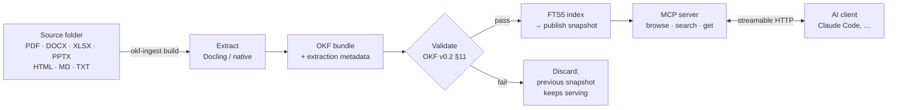

# OKF MCP Server

[](https://github.com/bsahane/okf-mcp-server/actions/workflows/test.yml)
[](https://www.python.org/downloads/)
[](https://github.com/GoogleCloudPlatform/open-knowledge-format/blob/main/SPEC.md)
[](LICENSE)

**Turn a folder of enterprise documents into cited, trust-aware answers for any MCP-capable AI.**

OKF MCP Server converts PDFs, Word, Excel, PowerPoint, HTML and Markdown into Google's [Open Knowledge Format (OKF)](https://github.com/GoogleCloudPlatform/open-knowledge-format). OKF stores knowledge as plain Markdown files with YAML metadata. The server exposes that knowledge through the [Model Context Protocol](https://modelcontextprotocol.io), so an assistant such as Claude can browse it, search it and quote it, pointing back to the exact page, sheet or section it came from.

> Ask *"What is the hotel limit in London?"* and the assistant finds the **current, human-reviewed** travel policy: *260 USD per night* (`travel-policy.md`, section "Hotels", lines 9–12). The superseded 2023 policy says 150 USD; it is still findable, but flagged `deprecated` and ranked lower.

---

## Contents

- [Why](#why)
- [How it works](#how-it-works)
- [Quick start](#quick-start)
- [Connect an AI client](#connect-an-ai-client)
- [Ingest your own documents](#ingest-your-own-documents)
- [MCP tools](#mcp-tools)
- [Configuration](#configuration)
- [Security model](#security-model)
- [Project layout](#project-layout)
- [Development](#development)
- [Troubleshooting](#troubleshooting)
- [Roadmap](#roadmap)
- [Acknowledgements](#acknowledgements)

## Why

Enterprise knowledge is spread across formats, much of it is out of date, and a model that "sort of remembers" a policy is worse than one that says it does not know. This project keeps three things visible in every answer:

| Question | How it is answered |
| --- | --- |
| **Where did this come from?** | Every passage carries its source file, content hash and location (page, sheet, section or lines). |
| **Should I trust it?** | OKF trust tiers from `verified`: `unverified`, `machine-confirmed` or `human-reviewed`. |
| **Is it still true?** | OKF `status` (`draft`, `stable`, `deprecated`) and `stale_after` are returned with every result. |

OKF itself is only files: you can `cat` it, diff it in git, open it in Obsidian, or throw the server away and keep your knowledge.

## How it works



1. **Extract.** Markdown and text are read natively. Everything else goes through [Docling](https://github.com/docling-project/docling), running locally. Page and sheet provenance is kept.
2. **Write OKF.** One concept per source file, with frontmatter filled deterministically from file metadata and an optional `_okf.yaml`. **No generative model is involved in ingestion.**
3. **Validate and publish.** The new snapshot must pass conformance checks before an atomic switch makes it live. A failed build never replaces a good snapshot.
4. **Serve.** Three read-only MCP tools. The AI client composes the answer; the server supplies evidence.

## Quick start

Requires Python 3.12+, [uv](https://docs.astral.sh/uv/) and `make`.

```bash
git clone git@github.com:bsahane/okf-mcp-server.git
cd okf-mcp-server
make install          # venv, dev dependencies, pre-commit hooks; opens a subshell (type `exit` to leave)
make ingest-install   # adds Docling for PDF/Office formats (large download)
make sample           # builds a snapshot from samples/finance into ./data
make local            # serves http://localhost:5001/mcp
```

Check it is up:

```bash
curl http://localhost:5001/health
```

The sample corpus is synthetic ("Acme" finance policies). It deliberately includes a deprecated policy that conflicts with the current one, a stale procedure, a Word document with a SKU table and a two-sheet Excel workbook.

## Connect an AI client

The server speaks MCP over **streamable HTTP** at `http://localhost:5001/mcp`. It only accepts local connections (see [Security model](#security-model)), so use a client running on the same machine.

**Claude Code**

```bash
claude mcp add --transport http okf http://localhost:5001/mcp
```

**MCP Inspector**, useful to try the tools by hand:

```bash
npx @modelcontextprotocol/inspector
```

Choose the *Streamable HTTP* transport and enter `http://localhost:5001/mcp`.

**Python (FastMCP client):** see [examples/fastmcp_client.py](examples/fastmcp_client.py).

```python
from fastmcp import Client

async with Client("http://localhost:5001/mcp") as client:
    result = await client.call_tool("search_knowledge", {"query": "hotel limit London"})
```

## Ingest your own documents

```bash
okf-ingest build /path/to/documents     # build and publish a new snapshot
okf-ingest validate                     # re-check the published bundle
okf-ingest eval questions.yaml          # measure retrieval quality (Hit@5)
okf-ingest suggest-config /path/to/documents > _okf.yaml   # draft metadata to review
```

Supported formats: `.pdf .docx .pptx .xlsx .html .htm .csv` (via Docling) and `.md .markdown .txt` (native). Hidden files are skipped. Unsupported types (archives, diagrams, …) are listed as `SKIPPED` and recorded in `manifest.json`, but do not block publishing. Empty files, and scans where OCR finds no text, are failures.

### What a build does

- **Mirrors your folders.** `policies/Travel Policy.pdf` becomes concept `policies/travel-policy`. Machine-generated file names (UUIDs, long hex, bare numbers) take their title from the document's first heading instead. Same-name files get their extension appended (`budget-pdf`, `budget-xlsx`), and the reserved names `index`/`log` get a `-doc` suffix.
- **Reuses work.** Files whose SHA-256 is unchanged reuse the previous extraction, so Docling does not run again. Renamed files are detected by content. Deleted files are gone from the new snapshot, and `log.md` records every creation, update, rename and deletion.
- **Keeps citations durable.** Locations are stored in `extraction/<source-id>.json` next to the bundle (including Docling's own JSON), so rebuilding the index never guesses locations from Markdown.
- **One build at a time.** A second build on the same data directory exits with an error instead of racing the first; leftovers from an interrupted build are cleaned up by the next one.
- **Publishes safely.** If any file fails to extract, or the bundle fails validation, nothing is published. `--allow-failures` publishes the rest and writes `failures.json`.
- **Stays inside the source folder.** Keep `OKF_DATA_DIR` outside the source folder; a data directory inside it is rejected so builds cannot ingest their own snapshots. Symlinked files that resolve outside the source folder, and partial Docling conversions, are reported as failures.

### Metadata with `_okf.yaml`

Put an optional `_okf.yaml` in the source root to set OKF types, lifecycle and review state. Full example: [samples/finance/_okf.yaml](samples/finance/_okf.yaml).

Start from `okf-ingest suggest-config <folder>`. It prints a draft with a comment on every guess: types from folder and file names, older dated versions (`… 2024` next to `… 2026`) and identical copies marked `deprecated`, and files named *draft* kept as drafts. It never reads document content and never marks anything `verified`; that is for document owners. Builds also warn about identical files until one of them is marked deprecated.

```yaml
bundle_title: Acme Finance knowledge
default_type: Reference
types:                              # longest matching path prefix wins
  policies/: Policy
  sops/: SOP
documents:
  policies/travel-policy.md:
    status: stable                  # draft (default) | stable | deprecated
    description: Current rules for booking and reimbursing business travel.
    tags: [finance, travel]
    stale_after: 2027-03-31T00:00:00Z
    verified:                       # a human: actor makes it "human-reviewed"
      - { by: "human:finance-owner", at: 2026-09-01T09:00:00Z }
  policies/travel-policy-2023.md:
    status: deprecated
```

The resulting concept looks like this (abridged):

```markdown
---
type: Policy
title: Acme Travel Policy (2026)
description: Current rules for booking and reimbursing business travel.
resource: file:///…/policies/travel-policy.md
tags: [finance, travel]
sources:
- id: src-d9ab7f29f6825d9a
  resource: file:///…/policies/travel-policy.md
  title: travel-policy.md
  last_modified: '2026-09-24T02:04:27Z'
generated: { by: okf-ingest/0.1.0, at: '2026-09-24T02:04:35Z' }
verified:
- { by: human:finance-owner, at: '2026-09-01T09:00:00Z' }
status: stable
stale_after: '2027-03-31T00:00:00Z'
source_revision: sha256:a9a99336…
---

## Hotels

The nightly hotel limit is 180 USD in most cities. In London, New York and Tokyo the limit is 260 USD per night.
```

### Measuring retrieval

Write the questions your users actually ask, together with the concepts that answer them. Include questions with no answer.

```yaml
questions:
  - question: What is the hotel limit per night in London?
    expected: [policies/travel-policy]
  - question: Who approves an expense claim over 1,000 USD?
    expected: [sops/expense-claims, reference/cost-centres]   # multi-source
  - question: What is the parental leave policy?
    expected: []                                               # no answer in the corpus
```

`okf-ingest eval` reports Hit@5, notes which multi-source questions were missing evidence, and flags deprecated or stale results. See [samples/finance-questions.yaml](samples/finance-questions.yaml).

### Scanned PDFs and speed

OCR runs only for PDFs where some page has no embedded text layer, which is a real scan. On born-digital PDFs it added no text in the pilot but made conversion 4.5× slower (3.5 s vs 0.8 s per page). The trade-off: text inside figures and diagrams of born-digital PDFs is not OCR'd. Unchanged files are never converted twice: a rebuild of four PDFs (171 pages) took 0.4 s instead of 12 minutes.

### Offline and air-gapped use

Docling downloads layout models on its first PDF conversion. To run without network access, pre-download them and set `DOCLING_ARTIFACTS_PATH`, or pass `okf-ingest build --artifacts-path <dir>`.

## MCP tools

| Tool | Arguments | Returns |
| --- | --- | --- |
| `browse_knowledge` | `path` (default root), `page_size` ≤ 100, `cursor` | Subdirectories and concepts with type, title, description, tags, status, trust tier and staleness. |
| `search_knowledge` | `query` ≤ 500 chars, `type`, `tags` (all must match), `limit` ≤ 20 | Ranked passages with excerpt, status, trust tier, stale flag and source (`uri`, `revision`, `location`, `location_text`). |
| `get_knowledge` | `concept_id`, `section`, `page_size` ≤ 20,000 chars, `cursor` | Concept or section content with sources, `generated`, `verified`, `stale_after`, a section list and `next_cursor`. |

Example `search_knowledge` result (trimmed):

```json
{
  "concept_id": "policies/travel-policy",
  "title": "Acme Travel Policy (2026)",
  "type": "Policy",
  "section": "hotels",
  "excerpt": "The nightly hotel limit is 180 USD in most cities. In London, New York and Tokyo the limit is 260 USD per night. …",
  "status": "stable",
  "trust_tier": "human-reviewed",
  "stale": false,
  "source": {
    "uri": "file:///…/finance/policies/travel-policy.md",
    "location": { "lines": [9, 12], "section": "Hotels" },
    "location_text": "section “Hotels”, lines 9–12"
  }
}
```

Behaviour worth knowing:

- **Errors are real MCP errors.** Invalid input returns `isError: true`, and so does a path outside the bundle. An empty search is a *successful* result with no evidence, so the assistant can say it does not know.
- **Search is keyword-based (SQLite FTS5, BM25).** Exact codes such as `SKU-4471` match reliably. Paraphrases depend on shared words; measure with `okf-ingest eval` before adding embeddings.
- **Pagination is snapshot-bound.** Once a new snapshot is published, older cursors ask the client to restart from the first page, so pages from two revisions are never mixed.
- **Excerpts are capped.** Search excerpts are at most 1,500 characters. When `excerpt_truncated` is true (for example, one oversized table row), read the section with `get_knowledge` and follow its cursor.

## Configuration

Settings come from environment variables or `.env`. `make local` creates `.env` from [.env.example](.env.example) if it is missing.

| Variable | Default | Purpose |
| --- | --- | --- |
| `OKF_DATA_DIR` | `./data` | Snapshot directory; `current` points at the snapshot being served. |
| `MCP_HOST` | `localhost` | Bind address. |
| `MCP_PORT` | `5001` | Port. |
| `MCP_TRANSPORT_PROTOCOL` | `http` | `http`/`streamable-http` (served at `/mcp`) or `sse`. |
| `ENABLE_AUTH` | `True` in code, `False` in `.env.example` | Template OAuth. The knowledge tools **refuse all requests** while it is on (see below). |
| `PYTHON_LOG_LEVEL` | `INFO` | Log level. |

The template's OAuth, SSL and PostgreSQL settings are documented in [docs/authentication.md](docs/authentication.md).

Snapshot layout:

```
data/
├── current -> snapshots/20260924T021553Z-66aefd
└── snapshots/<id>/
    ├── bundle/          # the OKF bundle: concepts, index.md per folder, log.md
    ├── extraction/      # per-source extraction metadata and locations
    ├── index.db         # SQLite FTS5 passage index
    └── manifest.json    # source ID → concept, revision, extractor
```

## Security model

This release is a **pilot for one trusted operator on one machine**. Use only documents that are approved for that machine.

- **No authentication, local only.** With auth disabled, the server rejects any request whose `Host` or `Origin` is not loopback (HTTP 421/403), protecting against DNS-rebinding attacks from web pages. FastMCP 2.14.2 does not enable the MCP SDK's own check. `/health` is exempt for container probes.
- **Fail closed.** Setting `ENABLE_AUTH=True` makes every knowledge tool refuse requests, because per-user permission filtering does not exist yet. The template authenticates callers but does not pass their identity to tools.
- **Confined reads.** Tools resolve paths, including symlinks, inside the bundle only, and reject reserved files. Output is bounded and paginated.
- **Evidence, not instructions.** Retrieved text and source links are returned as data. The server never fetches URLs or executes anything from the corpus.
- **Ingestion is operator-only.** AI clients cannot trigger builds or modify files.

Shared, multi-user deployment is planned work (see [Roadmap](#roadmap) and [PLAN.md](PLAN.md)).

## Project layout

```
okf_mcp_server/src/
├── api.py, main.py, mcp.py, settings.py   # template app, plus the Host/Origin guard and tool registration
├── tools/          # browse_knowledge, search_knowledge, get_knowledge (one file each)
├── knowledge/      # bundle reader, FTS5 index, snapshots, cursors, OKF validation
├── ingest/         # okf-ingest CLI, pipeline, native extractors, Docling adapter, eval
└── oauth/, storage/                        # template OAuth (not yet used by the tools)
samples/finance/     # synthetic pilot corpus and _okf.yaml
tests/               # unit, ingestion, tool and protocol tests
deployment/openshift # template manifests plus a read-only knowledge PVC
```

## Development

```bash
make lint             # ruff + mypy
make test             # pytest
make coverage         # 80% minimum, as enforced in CI
pytest -m docling     # Docling adapter tests (needs `make ingest-install`)
make pre-commit       # ruff, ruff-format, mypy, pydocstyle, bandit, file checks
pytest tests/test_http.py  # starts the real server and checks MCP over HTTP
```

- CI runs the main suite on Python 3.12 and 3.13 without Docling. The adapter is excluded from coverage and tested by a separate `ingest` job with the extra installed.
- New tools follow the template's docstring metadata format and raise `fastmcp.exceptions.ToolError` on failure. A returned `{"status": "error"}` payload would reach clients as a success.
- Containers: `make container` (Podman Compose). Compose publishes the MCP port on `127.0.0.1` only, mounts `./data` read-only, and starts PostgreSQL only with `--profile auth`.

## Troubleshooting

| Symptom | Fix |
| --- | --- |
| `address already in use` on start, or `/health` answers with another service's name | Port 5001 is taken. Set `MCP_PORT=5055` in `.env` and use that port in the client URL. |
| `421 Invalid Host header` / `403 Invalid Origin header` | The client is not connecting via `localhost`/`127.0.0.1`, or a browser page sent a foreign `Origin`. This is intended while auth is off. |
| Tool error: *no knowledge snapshot is published* | Run `make sample` or `okf-ingest build <folder>`, and check that `OKF_DATA_DIR` matches. |
| Tool error: *fails closed* | `ENABLE_AUTH` is on. Use `ENABLE_AUTH=False` for the local pilot. |
| Every request returns 401 | The server started without `.env`, so auth defaulted to on. Run `make local` or create `.env` first. |
| `snapshot … NOT published` | Read the `FAILED`/`INVALID` lines above it. Fix the files, or pass `--allow-failures`. |
| First PDF build is slow | Docling is downloading its models once; see [Offline and air-gapped use](#offline-and-air-gapped-use). |
| `lacks FTS5` | The Python SQLite build has no FTS5. Use a Python build that includes it; the uv-managed and python.org builds used in development do. |

## Roadmap

Tracked in detail in [PLAN.md](PLAN.md).

- [x] Ingestion to OKF v0.2 with provenance, validation and atomic snapshots
- [x] Browse, search and fetch MCP tools with trust and lifecycle signals
- [ ] Pilot on a real department corpus with ~30 real questions (phase 1)
- [ ] Per-user authentication and permission filtering, synchronized with source systems (phase 5)
- [ ] Hybrid search with embeddings (pgvector), if measured recall requires it
- [ ] Connectors (SharePoint, Google Drive, file shares), scheduled refresh, audit logs
- [ ] Container image and OpenShift deployment verified end to end

## Acknowledgements

- [Open Knowledge Format](https://github.com/GoogleCloudPlatform/open-knowledge-format) by Google Cloud Platform.
- Built on the [Red Hat Data & AI template MCP server](https://github.com/redhat-data-and-ai/template-mcp-server/tree/286b9e7b732af9d58f9dfd9be68c071e55919ea4) (commit `286b9e7`); its guides live in [docs/](docs/).
- [Docling](https://github.com/docling-project/docling) for document conversion and [FastMCP](https://github.com/jlowin/fastmcp) for the MCP server.

## License

[Apache 2.0](LICENSE), the same license as the template this project is based on.
