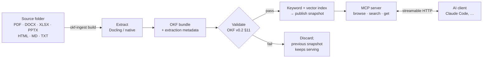

# OKF MCP Server

[](https://github.com/bsahane/okf-mcp-server/actions/workflows/test.yml)
[](https://www.python.org/downloads/)
[](https://github.com/GoogleCloudPlatform/open-knowledge-format/blob/main/SPEC.md)
[](LICENSE)

**Turn a folder of enterprise documents into cited, trust-aware answers for any MCP-capable AI.**

OKF MCP Server converts PDFs, Word, Excel, PowerPoint, HTML and Markdown into Google's [Open Knowledge Format (OKF)](https://github.com/GoogleCloudPlatform/open-knowledge-format). OKF stores knowledge as plain Markdown files with YAML metadata. The server exposes that knowledge through the [Model Context Protocol](https://modelcontextprotocol.io), so an assistant such as Claude can browse it, search it and quote it, pointing back to the exact page, sheet or section it came from.

> Ask *"What is the hotel limit in London?"* and the assistant finds the **current, human-reviewed** travel policy: *260 USD per night* (`travel-policy.md`, section "Hotels", lines 9–12). The superseded 2023 policy says 150 USD; it is still findable, but flagged `deprecated` and ranked lower.

---

## Contents

- [Why](#why)
- [How it works](#how-it-works)
- [Quick start](#quick-start)
- [Connect an AI client](#connect-an-ai-client)
- [Ingest your own documents](#ingest-your-own-documents)
- [Access control](#access-control)
- [Connectors and scheduled refresh](#connectors-and-scheduled-refresh)
- [MCP tools](#mcp-tools)
- [Configuration](#configuration)
- [Deploy on Kubernetes or OpenShift](#deploy-on-kubernetes-or-openshift)
- [Security model](#security-model)
- [Project layout](#project-layout)
- [Development](#development)
- [Troubleshooting](#troubleshooting)
- [Roadmap](#roadmap)
- [Acknowledgements](#acknowledgements)

## Why

Enterprise knowledge is spread across formats, much of it is out of date, and a model that "sort of remembers" a policy is worse than one that says it does not know. This project keeps three things visible in every answer:

| Question | How it is answered |
| --- | --- |
| **Where did this come from?** | Every passage carries its source file, content hash and location (page, sheet, section or lines). |
| **Should I trust it?** | OKF trust tiers from `verified`: `unverified`, `machine-confirmed` or `human-reviewed`. |
| **Is it still true?** | OKF `status` (`draft`, `stable`, `deprecated`) and `stale_after` are returned with every result. |

OKF itself is only files: you can `cat` it, diff it in git, open it in Obsidian, or throw the server away and keep your knowledge.

## How it works



1. **Extract.** Markdown and text are read natively. Everything else goes through [Docling](https://github.com/docling-project/docling), running locally. Page and sheet provenance is kept.
2. **Write OKF.** One concept per source file, with frontmatter filled deterministically from file metadata and an optional `_okf.yaml`. **No generative model is involved in ingestion.**
3. **Validate and publish.** The new snapshot must pass conformance checks before an atomic switch makes it live. A failed build never replaces a good snapshot.
4. **Serve.** Three read-only MCP tools. Search is hybrid: keyword (BM25) and semantic (local embeddings) rankings are fused, so "doctor's note" finds a policy that says "fit note". The AI client composes the answer; the server supplies evidence.

## Quick start

Requires Python 3.12+, [uv](https://docs.astral.sh/uv/) and `make`.

```bash
git clone git@github.com:bsahane/okf-mcp-server.git
cd okf-mcp-server
make install          # venv, dev dependencies, pre-commit hooks; opens a subshell (type `exit` to leave)
make ingest-install   # adds Docling for PDF/Office formats (large download)
okf-ingest fetch-model  # optional: local embedding model for semantic search (~493 MB)
make sample           # builds a snapshot from samples/finance into ./data
make local            # serves http://localhost:5001/mcp
```

Check it is up:

```bash
curl http://localhost:5001/health
```

The sample corpus is synthetic ("Acme" finance policies). It deliberately includes a deprecated policy that conflicts with the current one, a stale procedure, a Word document with a SKU table and a two-sheet Excel workbook.

## Connect an AI client

The server speaks MCP over **streamable HTTP** at `http://localhost:5001/mcp`. It only accepts local connections (see [Security model](#security-model)), so use a client running on the same machine.

**Claude Code**

```bash
claude mcp add --transport http okf http://localhost:5001/mcp
```

**MCP Inspector**, useful to try the tools by hand:

```bash
npx @modelcontextprotocol/inspector
```

Choose the *Streamable HTTP* transport and enter `http://localhost:5001/mcp`.

**Python (FastMCP client):** see [examples/fastmcp_client.py](examples/fastmcp_client.py).

```python
from fastmcp import Client

async with Client("http://localhost:5001/mcp") as client:
    result = await client.call_tool("search_knowledge", {"query": "hotel limit London"})
```

## Ingest your own documents

```bash
okf-ingest build /path/to/documents     # build and publish a new snapshot (-v for Docling/OCR logs)
okf-ingest validate                     # re-check the published bundle
okf-ingest eval questions.yaml          # measure retrieval quality (Hit@5)
okf-ingest suggest-config /path/to/documents > _okf.yaml   # draft metadata to review
```

Supported formats: `.pdf .docx .pptx .xlsx .html .htm .csv` (via Docling) and `.md .markdown .txt` (native). Hidden files are skipped. Unsupported types (archives, diagrams, …) are listed as `SKIPPED` and recorded in `manifest.json`, but do not block publishing. Empty files, and scans where OCR finds no text, are failures.

### What a build does

- **Mirrors your folders.** `policies/Travel Policy.pdf` becomes concept `policies/travel-policy`. Machine-generated file names (UUIDs, long hex, bare numbers) take their title from the document's first heading instead. Same-name files get their extension appended (`budget-pdf`, `budget-xlsx`), and the reserved names `index`/`log` get a `-doc` suffix.
- **Reuses work.** Files whose SHA-256 is unchanged reuse the previous extraction, so Docling does not run again. Renamed files are detected by content. Deleted files are gone from the new snapshot, and `log.md` records every creation, update, rename and deletion.
- **Keeps citations durable.** Locations are stored in `extraction/<source-id>.json` next to the bundle (including Docling's own JSON), so rebuilding the index never guesses locations from Markdown.
- **Bounded disk use.** Each build is a full snapshot, so only the newest 3 are kept (`--keep N`, minimum 2 so the previous one survives). Failed builds delete nothing.
- **One build at a time.** A second build on the same data directory exits with an error instead of racing the first; leftovers from an interrupted build are cleaned up by the next one.
- **Publishes safely.** If any file fails to extract, or the bundle fails validation, nothing is published. `--allow-failures` publishes the rest and writes `failures.json`.
- **Stays inside the source folder.** Keep `OKF_DATA_DIR` outside the source folder; a data directory inside it is rejected so builds cannot ingest their own snapshots. Symlinked files that resolve outside the source folder, and partial Docling conversions, are reported as failures.

### Metadata with `_okf.yaml`

Put an optional `_okf.yaml` in the source root to set OKF types, lifecycle and review state. Full example: [samples/finance/_okf.yaml](samples/finance/_okf.yaml).

Start from `okf-ingest suggest-config <folder>`. It prints a draft with a comment on every guess: types from folder and file names, older dated versions (`… 2024` next to `… 2026`) and identical copies marked `deprecated`, and files named *draft* kept as drafts. It never reads document content and never marks anything `verified`; that is for document owners. Builds also warn about identical files until one of them is marked deprecated.

```yaml
bundle_title: Acme Finance knowledge
default_type: Reference
types:                              # longest matching path prefix wins
  policies/: Policy
  sops/: SOP
documents:
  policies/travel-policy.md:
    status: stable                  # draft (default) | stable | deprecated
    description: Current rules for booking and reimbursing business travel.
    tags: [finance, travel]
    stale_after: 2027-03-31T00:00:00Z
    verified:                       # a human: actor makes it "human-reviewed"
      - { by: "human:finance-owner", at: 2026-09-01T09:00:00Z }
  policies/travel-policy-2023.md:
    status: deprecated
```

The resulting concept looks like this (abridged):

```markdown
---
type: Policy
title: Acme Travel Policy (2026)
description: Current rules for booking and reimbursing business travel.
resource: file:///…/policies/travel-policy.md
tags: [finance, travel]
sources:
- id: src-d9ab7f29f6825d9a
  resource: file:///…/policies/travel-policy.md
  title: travel-policy.md
  last_modified: '2026-09-24T02:04:27Z'
generated: { by: okf-ingest/0.1.0, at: '2026-09-24T02:04:35Z' }
verified:
- { by: human:finance-owner, at: '2026-09-01T09:00:00Z' }
status: stable
stale_after: '2027-03-31T00:00:00Z'
source_revision: sha256:a9a99336…
---

## Hotels

The nightly hotel limit is 180 USD in most cities. In London, New York and Tokyo the limit is 260 USD per night.
```

### Measuring retrieval

Write the questions your users actually ask, together with the concepts that answer them. Include questions with no answer.

```yaml
questions:
  - question: What is the hotel limit per night in London?
    expected: [policies/travel-policy]
  - question: Who approves an expense claim over 1,000 USD?
    expected: [sops/expense-claims, reference/cost-centres]   # multi-source
  - question: What is the parental leave policy?
    expected: []                                               # no answer in the corpus
```

`okf-ingest eval` reports Hit@5, notes which multi-source questions were missing evidence, and flags deprecated or stale results. Expected entries can also be source file paths as users know them (`HR/Leave Policy 2024.docx`). See [samples/finance-questions.yaml](samples/finance-questions.yaml) and the pilot template [samples/pilot-template/questions.yaml](samples/pilot-template/questions.yaml).

### Scanned PDFs and speed

OCR runs only for PDFs where some page has no embedded text layer, which is a real scan. On born-digital PDFs it added no text in the pilot but made conversion 4.5× slower (3.5 s vs 0.8 s per page). The trade-off: text inside figures and diagrams of born-digital PDFs is not OCR'd. Unchanged files are never converted twice: a rebuild of four PDFs (171 pages) took 0.4 s instead of 12 minutes.

Very large embedded images (above about 179 megapixels) are refused by Pillow's decompression-bomb protection and the file fails; around 90 megapixels Pillow only warns.

A reproducible synthetic benchmark lives in [samples/northwind](samples/northwind/README.md).

### Semantic search

Search combines two rankings with reciprocal-rank fusion: BM25 keywords, which are exact for codes and names, and a local multilingual embedding model ([intfloat/multilingual-e5-small](https://huggingface.co/intfloat/multilingual-e5-small), MIT, 94 languages, pinned revision), which matches meaning ("sign off a 25,000 purchase" finds the approval matrix). Each result reports `matched_by`: `keyword`, `semantic` or `both`.

- **Setup:** `okf-ingest fetch-model` downloads the model once (~493 MB) into the Hugging Face cache. Nothing is downloaded at build or query time, and no text leaves the machine.
- **Builds** embed every passage (69 passages/s on an Apple GPU, 17/s on CPU) and reuse vectors for unchanged passages, so a rebuild with no changes takes under a second and does not load the model. `--no-embeddings` builds keyword-only.
- **Fallback:** without the model or the `semantic` extra (torch, transformers), builds warn and search is keyword-only. `OKF_SEMANTIC_SEARCH=false` forces keyword-only. The server image installs no torch, so it is keyword-only unless built with `.[semantic]` and given the model cache.
- **Measured:** on the pilot papers, Hit@5 went from 0.81 to 0.94 and all-evidence from 0.69 to 0.81; on Northwind, Hit@1 went from 0.81 to 0.97; nothing got worse. Vector search always returns nearest neighbours, even for questions the corpus cannot answer, so the assistant must still judge relevance.
- **Scale:** vectors are compared by brute force in memory (about 10 ms for 600 passages). That is fine for tens of thousands of passages; move to pgvector or sqlite-vec beyond that.

### Offline and air-gapped use

Docling downloads layout models on its first PDF conversion. To run without network access, pre-download them and set `DOCLING_ARTIFACTS_PATH`, or pass `okf-ingest build --artifacts-path <dir>`.

## Access control

With `ENABLE_AUTH=True` every tool call needs a bearer token from your OIDC provider (Keycloak / Red Hat build of Keycloak, Entra ID, Okta, …). The server validates it by introspection and passes the caller's identity to the tools; tool arguments never carry identity.

- **Tokens:** the audience (`aud`) must include `OKF_REQUIRED_AUDIENCE` (403 otherwise); `OKF_REQUIRED_SCOPE` optionally requires a scope. Groups come from the `OKF_GROUPS_CLAIM` claim, by full path (Keycloak's `/finance/payroll` matches `group:finance/payroll`, not `group:payroll`). `user:` rules match the subject, the email only when `email_verified` is true, and the username unless it looks like someone else's email.
- **Documents:** each concept carries an `access` list of principals: `group:<name>`, `user:<email, username or subject>`, or `*` (any signed-in user). It comes from, in order, `documents.<file>.access` in `_okf.yaml`, the source system's permissions recorded by a connector, and path-prefix rules:

  ```yaml
  access:                     # in _okf.yaml; longest matching prefix wins
    finance/: [group:finance]
    hr/: {groups: [hr], users: [ceo@example.com]}
    public/: ["*"]
  ```

  Documents with no list follow `OKF_DEFAULT_ACCESS`: `deny` (default) or `authenticated`.
- **Filtering:** search filters keyword and semantic candidates before ranking, so hidden documents never take a result slot or leak a snippet; browse hides documents and folders with nothing visible; a denied fetch answers "not found", exactly like a missing one.
- **Changes:** group membership comes from the token, so removing someone from a group applies to their next token. Document permissions change with the next refresh, so the refresh interval is the maximum permission-sync delay. Revoked sessions fail introspection immediately (401).
- **Audit:** every tool call is logged as an `okf.audit` event with the caller, tool, query and returned documents, and appended as JSON lines to `OKF_AUDIT_LOG` if set. Ingestion adds `ingest.sync` and `ingest.build` events.

`tests/e2e/auth_e2e.py` checks all of this against a real Keycloak in Docker (12 checks: 401/403, per-group visibility, not-found on denial, revocation, group removal, audit).

## Connectors and scheduled refresh

Connectors mirror source systems, content and permissions, into a local folder that `okf-ingest build` reads. Secrets are only read from environment variables.

```yaml
# connectors.yaml
mirror: /var/lib/okf/mirror
okf_config: /etc/okf/_okf.yaml        # optional build rules, copied into the mirror
sources:
  - name: finance-share               # file share: local, NFS or SMB mount
    kind: fileshare
    path: /mnt/finance
    permissions: posix                # owner/group/mode bits -> principals; or none
  - name: hr-sharepoint               # SharePoint / OneDrive via Microsoft Graph (app-only)
    kind: sharepoint
    tenant_id: <tenant-id>
    client_id: <app-id>
    client_secret_env: OKF_SHAREPOINT_SECRET
    site: contoso.sharepoint.com:/sites/HR
    drive: Documents
    folder: Policies
  - name: ops-drive                   # Google Drive v3, service account
    kind: gdrive
    service_account_key_env: OKF_GDRIVE_KEY_FILE
    folder_id: <folder-id>
```

```bash
okf-ingest sync connectors.yaml       # mirror only
okf-ingest refresh connectors.yaml    # sync, then build and publish (schedule this)
```

- **Incremental and exact:** unchanged items are not downloaded, deletions are removed, a failed download keeps the last good copy, and a source that fails to list keeps its previous mirror. `refresh` does not build after a failed sync unless `--allow-failures`.
- **Permissions:** file shares map owner, group and mode bits; SharePoint maps users, Entra and SharePoint groups and organization/anonymous links (`group_names: id` if your tokens carry group IDs); Drive maps users, groups, domain and anyone. Each source can set a default `access` for items without source permissions.
- **Formats:** Google Docs, Sheets and Slides are exported as DOCX, XLSX and PPTX.
- **Scheduling:** on Kubernetes/OpenShift the `okf-refresh` CronJob runs `refresh` nightly (`concurrencyPolicy: Forbid`; builds also lock the data directory). On a server, use cron: `0 2 * * * /opt/okf/.venv/bin/okf-ingest --data-dir /var/lib/okf/data refresh /etc/okf/connectors.yaml`.

SharePoint and Google Drive are tested against mock servers that follow the Graph and Drive APIs (paging, throttling, redirects, exports, permissions); they have not yet been run against a live tenant. `tests/e2e/connectors_live.py` does that read-only with your `connectors.yaml`, see [docs/live-checks.md](docs/live-checks.md). File shares are tested on real files and in the Kubernetes end-to-end run.

## MCP tools

| Tool | Arguments | Returns |
| --- | --- | --- |
| `browse_knowledge` | `path` (default root), `page_size` ≤ 100, `cursor` | Subdirectories and concepts with type, title, description, tags, status, trust tier and staleness. |
| `search_knowledge` | `query` ≤ 500 chars, `type`, `tags` (all must match), `limit` ≤ 20 | Ranked passages with excerpt, status, trust tier, stale flag and source (`uri`, `revision`, `location`, `location_text`). |
| `get_knowledge` | `concept_id`, `section`, `page_size` ≤ 20,000 chars, `cursor` | Concept or section content with sources, `generated`, `verified`, `stale_after`, a section list and `next_cursor`. |

Example `search_knowledge` result (trimmed):

```json
{
  "concept_id": "policies/travel-policy",
  "title": "Acme Travel Policy (2026)",
  "type": "Policy",
  "section": "hotels",
  "excerpt": "The nightly hotel limit is 180 USD in most cities. In London, New York and Tokyo the limit is 260 USD per night. …",
  "status": "stable",
  "trust_tier": "human-reviewed",
  "stale": false,
  "source": {
    "uri": "file:///…/finance/policies/travel-policy.md",
    "location": { "lines": [9, 12], "section": "Hotels" },
    "location_text": "section “Hotels”, lines 9–12"
  }
}
```

Behaviour worth knowing:

- **Errors are real MCP errors.** Invalid input returns `isError: true`, and so does a path outside the bundle. An empty search is a *successful* result with no evidence, so the assistant can say it does not know.
- **Search is hybrid and returns one result per section.** Exact codes such as `SKU-4471` match through keywords, paraphrases through embeddings (see [Semantic search](#semantic-search)), and Unicode math letters and ligatures from PDFs match plain words. `search_mode` says whether a request ran `hybrid` or `keyword`. Measure changes with `okf-ingest eval`, which accepts `concept#section` expectations and reports Hit@1, Hit@5, MRR and all-evidence.
- **Pagination is snapshot-bound.** Once a new snapshot is published, older cursors ask the client to restart from the first page, so pages from two revisions are never mixed.
- **Excerpts are capped.** Search excerpts are at most 1,500 characters. When `excerpt_truncated` is true (for example, one oversized table row), read the section with `get_knowledge` and follow its cursor.

## Configuration

Settings come from environment variables or `.env`. `make local` creates `.env` from [.env.example](.env.example) if it is missing.

| Variable | Default | Purpose |
| --- | --- | --- |
| `OKF_DATA_DIR` | `./data` | Snapshot directory; `current` points at the snapshot being served. |
| `OKF_SEMANTIC_SEARCH` | `True` | Hybrid search when the index has vectors and the model is installed; `False` forces keyword-only. |
| `MCP_HOST` | `localhost` | Bind address. |
| `MCP_PORT` | `5001` | Port. |
| `MCP_TRANSPORT_PROTOCOL` | `http` | `http`/`streamable-http` (served at `/mcp`) or `sse`. |
| `ENABLE_AUTH` | `True` in code, `False` in `.env.example` | Token authentication and per-user filtering (see [Access control](#access-control)); needs `SSO_*` and `POSTGRES_*` settings. |
| `OKF_VECTOR_BACKEND` | `auto` | `numpy` (in memory, fastest), `sqlite-vec` (on disk, flat memory) or `auto` (numpy up to 50k vectors). |
| `OKF_DEFAULT_ACCESS` | `deny` | With auth on, who sees documents without an access list: `deny` or `authenticated`. |
| `OKF_REQUIRED_AUDIENCE` | empty | Reject tokens whose `aud`/`azp` lacks this value (set it, e.g. `okf-mcp`). |
| `OKF_REQUIRED_SCOPE` | empty | Reject tokens without this scope. |
| `OKF_GROUPS_CLAIM` | `groups` | Token claim holding the caller's groups. |
| `OKF_AUDIT_LOG` | empty | Append a JSON line per tool call and ingestion event to this file. |
| `PYTHON_LOG_LEVEL` | `INFO` | Log level. |

The template's OAuth, SSL and PostgreSQL settings are documented in [docs/authentication.md](docs/authentication.md).

Snapshot layout:

```
data/
├── current -> snapshots/20260924T021553Z-66aefd
└── snapshots/<id>/
    ├── bundle/          # the OKF bundle: concepts, index.md per folder, log.md
    ├── extraction/      # per-source extraction metadata and locations
    ├── index.db         # SQLite FTS5 passage index
    └── manifest.json    # source ID → concept, revision, extractor
```

## Deploy on Kubernetes or OpenShift

```bash
docker build -t <registry>/okf-mcp-server:<tag> -f Containerfile .                  # server
docker build -t <registry>/okf-mcp-server-ingest:<tag> --build-arg EXTRAS=ingest -f Containerfile .  # PDF/Office ingestion
kubectl apply -k deployment/kubernetes      # plain Kubernetes (set the image in its kustomization)
make deploy openshift NAMESPACE=<project>   # OpenShift: builds both images in the cluster, ImageStream + Route
```

The server image is 1.25 GB. The ingest image (3.1 GB) adds Docling with CPU-only PyTorch and headless OpenCV, and bakes Docling's layout, table and OCR models into `/app/models`, so refresh jobs need no internet and no writable paths beyond `/tmp`; point the CronJob at it for PDF and Office sources (the OpenShift overlay does, and builds it with a second BuildConfig). Verified: the full Northwind corpus ingests in it air-gapped (`--network none`), read-only, as an arbitrary UID, with the same 59 concepts as a local build.

`deployment/base` holds the Deployment, Service, ConfigMap, Secret, PVC and the refresh CronJob with its connectors ConfigMap; the overlays add the OpenShift-only BuildConfig, ImageStream and Route, or a local image for plain Kubernetes. Pods match OpenShift's restricted-v2 SCC: any non-root UID, no privilege escalation, all capabilities dropped, RuntimeDefault seccomp and a read-only root filesystem. Authentication is on by default; fill in the ConfigMap's `SSO_*` URLs and the Secret, and provision PostgreSQL for the template's OAuth state. The CronJob writes snapshots to the PVC and the server reads them read-only, so a refresh is served without a restart. The PVC can be ReadWriteOnce: the Deployment uses the `Recreate` strategy and the CronJob has pod affinity to the server's node; with a ReadWriteMany storage class the affinity can be removed.

Verified: `tests/e2e/k8s_e2e.py` deploys the Kubernetes overlay with Keycloak and PostgreSQL into a throwaway namespace (10 checks: arbitrary UID, read-only root, refresh Job from the CronJob, 401, per-group visibility, refresh without restart, audit); with `--ingest-image` the CronJob runs the ingest image and converts a Word document with Docling in the cluster, and `tests/e2e/validate_manifests.sh` validates both overlays strictly, the OpenShift kinds against OpenShift 4.18 schemas (also run in CI). `k8s_e2e.py --platform openshift --build` runs the same checks on OpenShift (in-cluster builds, restricted-v2 UID range, Route); it is ready but has not yet been run on a live OpenShift cluster, see [docs/live-checks.md](docs/live-checks.md).

## Security model

- **Two modes.** With `ENABLE_AUTH=False` (local pilot) the operator is trusted and sees everything, and the server rejects any request whose `Host` or `Origin` is not loopback (HTTP 421/403) to stop DNS-rebinding attacks from web pages; FastMCP 2.14.2 does not enable the MCP SDK's own check. With `ENABLE_AUTH=True` (shared) every call needs a valid token with the right audience, and results are filtered per user; see [Access control](#access-control). Without a validated identity the tools fail closed.
- **Confined reads.** Tools resolve paths, including symlinks, inside the bundle only, and reject reserved files. Connectors sanitize remote names so nothing escapes the mirror, and file shares follow links only when they stay inside the share. Output is bounded and paginated.
- **Evidence, not instructions.** Retrieved text and source links are returned as data. The server never fetches URLs or executes anything from the corpus.
- **Ingestion is operator-only.** AI clients cannot trigger builds, syncs or file changes.
- **Known template gap.** The template's own `/auth/token` endpoint issues placeholder tokens. Clients should get tokens from your identity provider; this server only validates them.

## Project layout

```
okf_mcp_server/src/
├── api.py, main.py, mcp.py, settings.py   # template app, plus the Host/Origin guard and tool registration
├── tools/          # browse_knowledge, search_knowledge, get_knowledge (one file each)
├── knowledge/      # bundle reader, FTS5 + vector index, embeddings, snapshots, cursors, validation
├── ingest/         # okf-ingest CLI, pipeline, native extractors, Docling adapter, eval
├── connectors/     # fileshare, SharePoint (Graph), Google Drive; mirror sync; connectors.yaml
└── oauth/, storage/                        # template OAuth: token validation feeds the caller identity
samples/finance/     # synthetic pilot corpus and _okf.yaml
samples/northwind/   # synthetic messy-company benchmark (generator + questions)
samples/gitlab-handbook/  # Phase 1 pilot on a real public HR corpus (fetch script + questions)
tests/               # unit, ingestion, tool, access, connector and protocol tests
tests/e2e/           # Keycloak auth, Kubernetes deployment and manifest validation
deployment/          # base + kubernetes and openshift overlays
```

## Development

```bash
make lint             # ruff + mypy
make test             # pytest
make coverage         # 80% minimum, as enforced in CI
pytest -m docling     # Docling adapter tests (needs `make ingest-install`)
make pre-commit       # ruff, ruff-format, mypy, pydocstyle, bandit, file checks
pytest tests/test_http.py  # starts the real server and checks MCP over HTTP
python tests/e2e/auth_e2e.py          # real Keycloak + PostgreSQL in Docker
python tests/e2e/k8s_e2e.py           # deployment on a Kubernetes cluster (default context: orbstack)
python tests/e2e/k8s_e2e.py --ingest-image okf-mcp-server-ingest:dev   # refresh with Docling, incl. a DOCX
tests/e2e/validate_manifests.sh       # kubeconform, strict, incl. OpenShift schemas
```

- CI runs the main suite on Python 3.12 and 3.13 without Docling. The adapter is excluded from coverage and tested by a separate `ingest` job with the extra installed.
- New tools follow the template's docstring metadata format and raise `fastmcp.exceptions.ToolError` on failure. A returned `{"status": "error"}` payload would reach clients as a success.
- Containers: `make container` (Podman or Docker Compose; `OKF_HOST_PORT` sets the host port). Compose publishes the MCP port on `127.0.0.1` only, mounts `./data` read-only, and starts PostgreSQL only with `--profile auth`.

## Troubleshooting

| Symptom | Fix |
| --- | --- |
| `address already in use` on start, or `/health` answers with another service's name | Port 5001 is taken. Set `MCP_PORT=5055` in `.env` and use that port in the client URL. |
| `421 Invalid Host header` / `403 Invalid Origin header` | The client is not connecting via `localhost`/`127.0.0.1`, or a browser page sent a foreign `Origin`. This is intended while auth is off. |
| Tool error: *no knowledge snapshot is published* | Run `make sample` or `okf-ingest build <folder>`, and check that `OKF_DATA_DIR` matches. |
| Tool error: *fails closed* | Auth is on but the request carried no validated identity (for example browser-auth mode). Send a bearer token, or use `ENABLE_AUTH=False` for the local pilot. |
| 403 with a valid token | The token's audience does not include `OKF_REQUIRED_AUDIENCE`, or it lacks `OKF_REQUIRED_SCOPE`. Add an audience mapper for the MCP client in your identity provider. |
| Search finds nothing for a user | Their groups match no document's access list, or documents have none and `OKF_DEFAULT_ACCESS=deny`. Check the token's groups claim and `_okf.yaml`. |
| Every request returns 401 | The server started without `.env`, so auth defaulted to on. Run `make local` or create `.env` first. |
| `snapshot … NOT published` | Read the `FAILED`/`INVALID` lines above it. Fix the files, or pass `--allow-failures`. |
| First PDF build is slow | Docling is downloading its models once; see [Offline and air-gapped use](#offline-and-air-gapped-use). |
| `lacks FTS5` | The Python SQLite build has no FTS5. Use a Python build that includes it; the uv-managed and python.org builds used in development do. |

## Roadmap

Tracked in detail in [PLAN.md](PLAN.md).

- [x] Ingestion to OKF v0.2 with provenance, validation and atomic snapshots
- [x] Browse, search and fetch MCP tools with trust and lifecycle signals
- [x] Hybrid keyword + semantic search with a local embedding model
- [x] Pilot on a real department corpus (GitLab Handbook HR, 94 pages, 30 questions): Hit@5 0.93
- [x] Per-user authentication and permission filtering, synchronized from source systems; audit log
- [x] sqlite-vec backend chosen automatically when the corpus outgrows in-memory search
- [x] Connectors (file shares, SharePoint, Google Drive) and scheduled refresh
- [x] Container image and Kubernetes deployment verified end to end; OpenShift manifests schema-validated
- [ ] Pilot on your own department's documents with questions from its users (runbook and question template ready: [docs/live-checks.md](docs/live-checks.md))
- [ ] SharePoint and Google Drive against a live tenant; OpenShift on a live cluster (one-command checks ready, need your access)

## Acknowledgements

- [Open Knowledge Format](https://github.com/GoogleCloudPlatform/open-knowledge-format) by Google Cloud Platform.
- Built on the [Red Hat Data & AI template MCP server](https://github.com/redhat-data-and-ai/template-mcp-server/tree/286b9e7b732af9d58f9dfd9be68c071e55919ea4) (commit `286b9e7`); its guides live in [docs/](docs/).
- [Docling](https://github.com/docling-project/docling) for document conversion and [FastMCP](https://github.com/jlowin/fastmcp) for the MCP server.

## License

[Apache 2.0](LICENSE), the same license as the template this project is based on.
